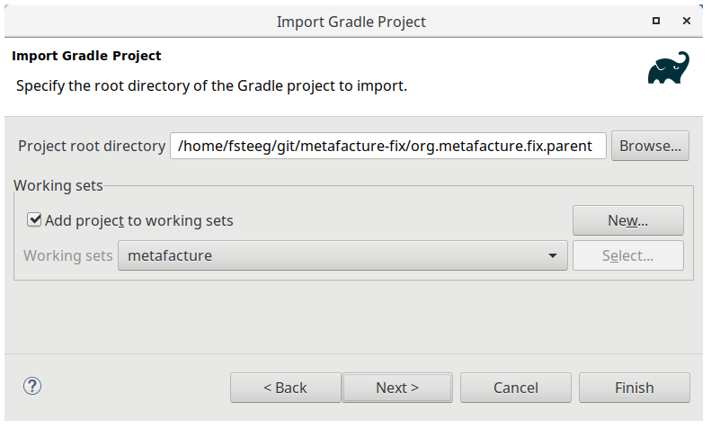
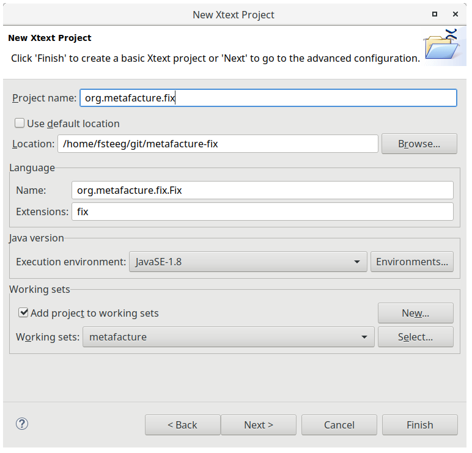
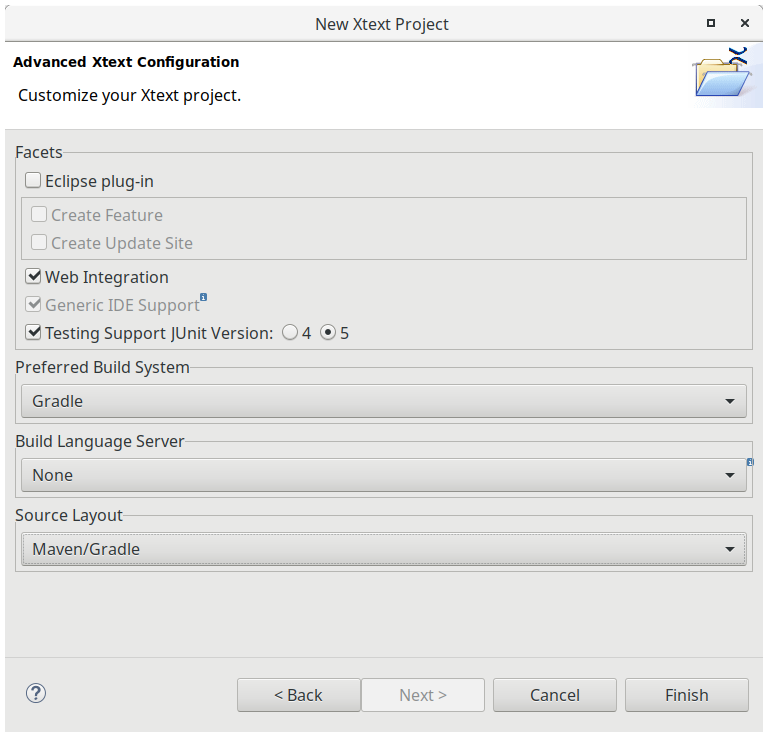

About
-----

This is early work in progress towards an implementation of the Fix language for Metafacture as an alternative to configuring data transformations with [Metamorph](https://github.com/metafacture/metafacture-core/wiki#morph).

See [https://github.com/elag/FIG](https://github.com/elag/FIG)

State
-----

[](https://travis-ci.org/metafacture/metafacture-fix)

This repo contains an Xtext web project with a basic Fix grammar, which generates a parser and a web editor. The editor UI contains input fields for sample data and a [Flux](https://github.com/metafacture/metafacture-core/wiki#flux) definition to run workflows with the given Fix. A test deployment is available at: [http://test.lobid.org/fix](http://test.lobid.org/fix)

- [x] Grammar, parser, and editor for the [Fix language]((https://github.com/LibreCat/Catmandu/wiki/Fix-language)) ([details](#editor))
- [x] Run Fix as a module in Flux workflows ([wiki](https://github.com/metafacture/metafacture-core/wiki/Flux-user-guide)) ([details](http://test.lobid.org/fix))
- [x] Change field names, (nested) field [paths](https://github.com/LibreCat/Catmandu/wiki/Paths) ([details](http://test.lobid.org/fix))
- [ ] Change field values, use `metamorph.functions` ([wiki](https://github.com/metafacture/metafacture-core/wiki/Metamorph-functions)) as Fix [functions](https://github.com/LibreCat/Catmandu/wiki/Functions) like `replace_all(title,"My (.*) Pony","Our $1 Fish")` [#5](https://github.com/metafacture/metafacture-fix/issues/5)
- [ ] Data lookup, use `metamorph.maps` ([wiki](https://github.com/metafacture/metafacture-core/wiki/Data-lookup)) like `lookup(title,"dict.csv",default:'NONE')`
- [ ] Use `metamorph.collectors` and `<if>` ([wiki](https://github.com/metafacture/metafacture-core/wiki/Metamorph-collectors), [commit](https://github.com/metafacture/metafacture-core/commit/0530d6ad72ced992b479bff94d6f56bbef77bb2d)) for Fix [selectors](https://github.com/LibreCat/Catmandu/wiki/Selectors) and [conditionals](https://github.com/LibreCat/Catmandu/wiki/Conditionals) like `if exists(my.deep.field) <function1 function2> end`
- [ ] Support function grouping ([wiki](https://github.com/metafacture/metafacture-core/wiki/Metamorph-User-Guide#processing-pieces-of-data)) with [binds](https://github.com/LibreCat/Catmandu/wiki/Binds) like `do list(path:colors.*, var:c) <function1(c) function2(c)> end`
- [ ] [Comments](https://github.com/LibreCat/Catmandu/wiki/Comments) like `# This is a comment` [#4](https://github.com/metafacture/metafacture-fix/issues/4)
- [ ] Integrated web playground with Fix and Flux editors ([language](https://github.com/culturegraph/metafacture-ide/tree/master/bundles/org.culturegraph.mf.ide/src/org/culturegraph/mf/ide), [setup](https://github.com/metafacture/metafacture-fix#xtext))

Setup
-----

Go to the Xtext project:

`cd metafacture-fix/`

Run the tests (in `org.metafacture.fix/src/test/java`):

`./gradlew clean test`

Editor
------

Start the server:

`./gradlew jettyRun`

Visit [http://localhost:8080/](http://localhost:8080/), and paste this into the editor:

```
# Fix is a macro-language for data transformations

# Simple fixes

add_field(hello,world)
remove_field(my.deep.nested.junk)
copy_field(stats,output.$append)

# Conditionals

if exists(error)
    set_field(is_valid, no)
    log(error)
elsif exists(warning)
    set_field(is_valid, yes)
    log(warning)
else
    set_field(is_valid, yes)
end

# Loops

do list(path)
    add_field(foo,bar)
end

# Nested expressions

do marc_each()
    if marc_has(f700)
        marc_map(f700a,authors.$append)
    end
end
```

Content assist is triggered with Ctrl-Space. The input above is also used in `FixParsingTest.xtend`.

Module
------

The `Metafix` stream module currently supports:

```
# simple field name mappings

map(a,b)

# nested field structure

map(e1)
map(e1.e2)
map(e1.e2.d)

# pass-through for unmapped fields

map(_else)
```

See also `MetafixDslTest.java`.

Workflows
--------

Run workflows, passing `data`, `flux`, and `fix`:

[http://localhost:8080/xtext-service/run?data='1'{'a': '5', 'z': 10}&flux=as-lines|decode-formeta|fix|encode-formeta(style="multiline")&fix=map(a,b) map(_else)](http://localhost:8080/xtext-service/run?data=%271%27{%27a%27:%20%275%27,%20%27z%27:%2010}&flux=as-lines|decode-formeta|fix|encode-formeta(style=%22multiline%22)&fix=map(a,c)%20map(_else))

Xtext
-----

To import the projects in Eclipse, choose File > Import > Existing Gradle Project:



This repo has been originally set up with Xtext 2.17.0 and Eclipse for Java 2019-03, following [https://www.eclipse.org/Xtext/documentation/104_jvmdomainmodel.html](https://www.eclipse.org/Xtext/documentation/104_jvmdomainmodel.html). Below are some details to reproduce the original setup:

In the New > Xtext Project wizard, the language details are specified:



As well as the project and build customization:


